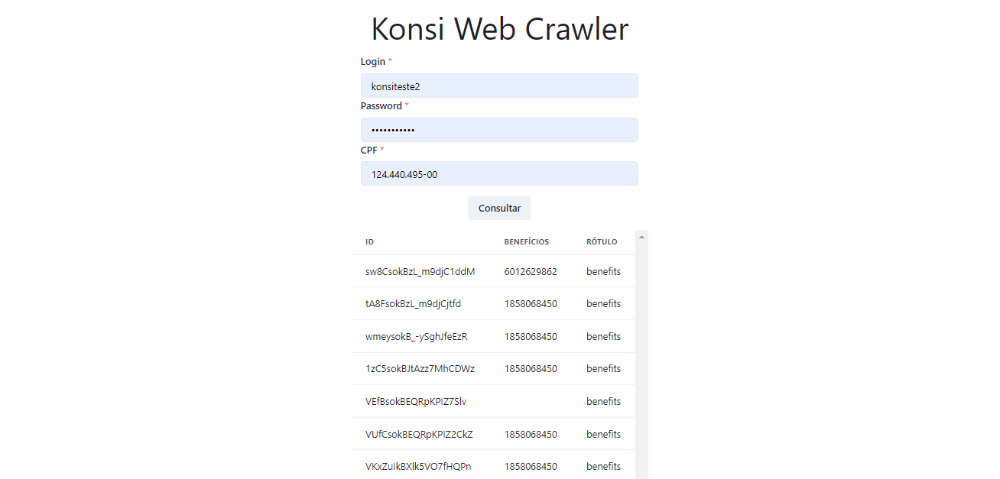
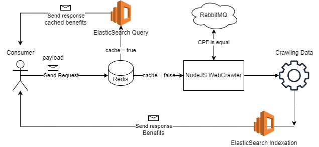

<h1 align="center">
 Konsi web crawler
</h1>

This project publish some sensible data in **rabbitmq**, do webscrapper with **puppeteer** and collect a specific data with the automated scrapper, save the data in the **redis** cache, index/search the cached data in **elasticsearch**, then return to the client.

check it out the screenshot of the UI (simple):


#

and the application flow:

<br>



#

To clone and run this application, you'll need [Git](https://git-scm.com) and [NodeJS](https://nodejs.org/en/download).

#

Before run the project, watch out the environment variables in backend/.env.example. create a .env file in the root of backend directory and paste this:

Redis client.
REDIS_CLIENT_URL=redis://redis:6379

Elastic search client.
ELASTIC_CLIENT_URL=http://elasticsearch:9200

RabbitMQ client.RABBITMQ_CLIENT_URL=amqp://rabbitmq:5672

user for rabbitmq web management
RABBITMQ_LOGIN=guest

password for rabbitmq web management
RABBITMQ_PWD=guest

/usr/bin/google-chrome-stable
PUPPETEER_PATH=/usr/bin/google-chrome-stable

#

```bash
# Clone this repository
$ git clone https://github.com/Leoff00/webcrawler.git

# Enter in the backend repository
$ cd backend

# Run the composer
$ docker-compose up --build

# Enter in the frontend repository
$ cd frontend

# Run the react project
$ yarn dev
```

## Credits

This software uses the following open source packages:

Frontend libs:

- [React](https://react.dev/)
- [React-query](https://tanstack.com/query/v4/docs/react/overview)
- [ChakraUI](https://chakra-ui.com/getting-started)
- [axios](https://axios-http.com/)

Backend libs:

- [Express](https://expressjs.com/pt-br/)
- [Redis](https://redis.io/docs/clients/nodejs/)
- [amqp(RabbitMQ)](https://www.rabbitmq.com/tutorials/tutorial-one-javascript.html)
- [elasticsearch](https://www.elastic.co/guide/en/elasticsearch/client/javascript-api/current/index.html)
- [puppeteer](https://pptr.dev/)
- [cors](https://expressjs.com/en/resources/middleware/cors.html)
- [dotenv](https://www.npmjs.com/package/dotenv)
- [winston](https://github.com/winstonjs/winston)

##### Made by: Leonardo Ferreira
